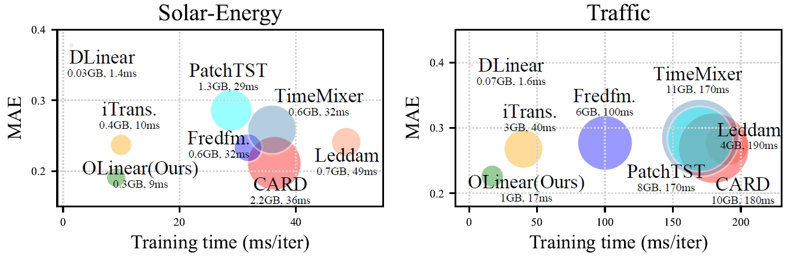

# OLinear

The repo is the official implementation for the paper: OLinear: A Linear Model for Time Series Forecasting in Orthogonally Transformed Domain.


## Introduction

🌟 The current temporal forecast (TF) paradigm struggles to fully exploit the forecasting potential  in the presence of entangled intra-series dependencies. 
To address this, we propose OrthoTrans, which transforms the time domain to the orthogonally transformed domain, where temporal correlations are effectively removed.
Notably, OrthoTrans is modular and can be integrated into existing forecasters to enhance their performance. 


<p align="center">

</p>

In-depth ablation studies reveal that OrthoTrans promotes representation diversity and increases the rank of attention matrices in Transformer-based models.

<p align="center">

</p>

🏆 Our model integrates two components: 1) Cross-Series Learner (CSL): captures multivariate dependencies using a customized linear layer named **NormLin**. 2) Intra-Series Learner (ISL): models dynamics across the temporal dimension.

Surprisingly, NormLin consistently outperforms the classic multi-head self-attention mechanism, while being more efficient. 
This **challenges** the necessity of Transformers in time series forecasting. 

<p align="center">

</p>

😊 **OLinear** consistently achieves state-of-the-art performance across 24 benchmarks and 140 forecasting tasks, demonstrating both effectiveness and efficiency. **Linear is all you need in time series forecasting.**

<p align="center">

</p>


## Usage 

1. Install Pytorch and necessary dependencies.

```
pip install -r requirements.txt
```

2. Some datasets can be obtained from [Google Drive](https://drive.google.com/file/d/1l51QsKvQPcqILT3DwfjCgx8Dsg2rpjot/view?usp=drive_link) or [Tsinghua Cloud](https://cloud.tsinghua.edu.cn/f/2ea5ca3d621e4e5ba36a/).  The others can be obtained from the links in Appendix B. 
Some datasets are already in the folder ```./dataset```. 
The python script ```Generate_corrmat.ipynb``` for generating Pearson correlation matrices and Q matrices is also provided in ```./dataset```.

3. Train and evaluate the model. We provide the scripts under the folder ```./scripts```. You can reproduce the results in the paper using these scripts.

```
# Forecasting with OLinear
bash ./scripts/OLinear/ECL_orthoLinear.sh

# Forecasting with OLinear-C
bash ./scripts/OLinear_C/ETTm1_orthoLinear.sh

# Ablation studies on model along the variate and temporal dimensions
bash ./scripts/ablation/var_temp/ECL_OLinear_var_temp.sh

# Comparison with self-attention and its variants
bash ./scripts/ablation/attn_var/ECL_orthoLinear.sh

# Comparison with other transformation bases
bash ./scripts/ablation/basis/ECL_OLinear_basis.sh
```

## Main Result of Multivariate Forecasting
We evaluate OLinear on 24 challenging multivariate forecasting benchmarks, with a total of 140 forecasting tasks.

<p align="center">

</p>

### Long-term forecasting (Avg Results)

<p align="center">

</p>


### Short-term forecasting (Avg Results)

<p align="center">

</p>


## Comparing with the attention mechanism

Despite its simplicity, NormLin consistently outperforms the classic self-attention mechanism, and its recent variants. **Perhaps, attention is not all you need in time series forecasting.**

<p align="center">

</p>

## Model Ablations

We conduct ablation study of OLinear by replacing or removing components along the variate and temporal dimensions. NormLin and standard linear are suitable for capturing multivariate correlations and temporal dynamics, respectively.

<p align="center">

</p>


## Generality

The proposed orthogonal transformation and NormLin module can consistently boost state-of-the-art forecasters.

<p align="center">

</p>

<p align="center">

</p>


## Model Efficiency

As a linear model, OLinear exhibits significantly better efficiency than the Transformer-based forecasters while achieving better performance.

<p align="center">

</p>


## Acknowledgement

We appreciate the following GitHub repos a lot for their valuable code and efforts.
- iTransformer (https://github.com/thuml/iTransformer)
- Time-Series-Library (https://github.com/thuml/Time-Series-Library)
- Fredformer (https://github.com/chenzRG/Fredformer)
- Leddam (https://github.com/Levi-Ackman/Leddam)
- OpenLTM (https://github.com/thuml/OpenLTM)
